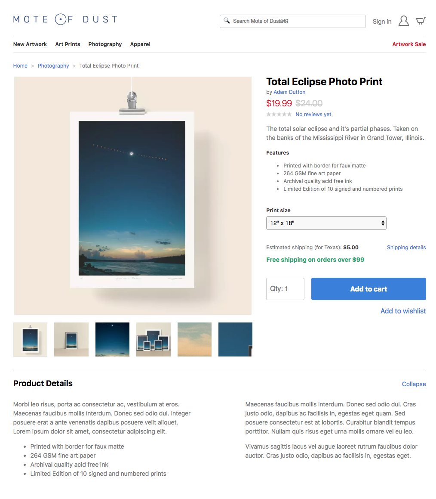

Product Page with Tachyons
======

The purpose of this project is to show how Tachyons can be flexible enought to handle a variety of layouts and styles without having to add new CSS selectors to the library. Screenshots are provided below with the number of CSS selectors added/removed. Initial layout and design provided by Adam Dutton.

Initial Layout (commit: base)
------

